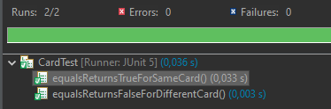
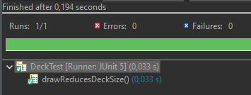
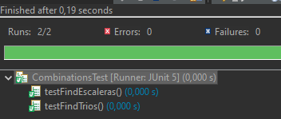
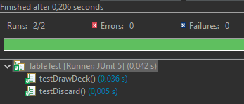
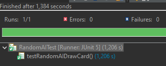
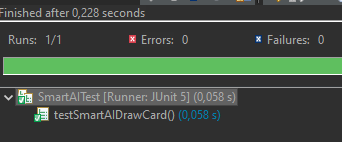

# Evidencias

## Caja Blanca

### Card.equals

* Descripción:
Verifica que dos cartas con el mismo palo y valor sean consideradas iguales y que cartas diferentes no lo sean.

* Objetivo:
Comprobar el correcto funcionamiento de la comparación de objetos Card.

```java
 @Test
 void equalsReturnsTrueForSameCard() {

  Card c1 = new Card("⚔️", "5");
  Card c2 = new Card("⚔️", "5");

  assertEquals(c1, c2);
 }
 @Test
 void equalsReturnsFalseForDifferentCard() {

  Card c1 = new Card("⚔️", "5");
  Card c2 = new Card("🟡", "5");

  assertNotEquals(c1, c2);
 }
```



### Deck.draw

* Descripción:
Comprueba que al robar una carta del mazo, éste reduce su tamaño en una unidad.

* Objetivo:
Validar la modificación interna de la colección de cartas.

```java
 @Test
 void drawReducesDeckSize() {

  Deck deck = new Deck(1);

  int initial = deck.size();

  deck.draw();

  assertEquals(initial - 1, deck.size());
 }
```



### Combinations.findTrios

* Descripción:
Verifica que el detector de tríos encuentra correctamente tres cartas del mismo valor.

* Objetivo:
Cubrir la lógica de agrupación por valor.

```java
@Test
 void testFindTrios() {

  Combinations combinations = new Combinations();

  List<Card> hand = List.of(new Card("🟡", "5"), new Card("⚔️", "5"), new Card("🍷", "5"));

  List<List<Card>> result = combinations.findTrios(hand);

  assertEquals(1, result.size());
 }
```


### Combinations.findEscaleras

* Descripción:
Comprueba que una secuencia consecutiva del mismo palo es detectada como escalera.

* Objetivo:
Validar la lógica de ordenación y comprobación de consecutividad.

```java
@Test
 void testFindEscaleras() {

  Combinations combinations = new Combinations();

  List<Card> hand = List.of(new Card("🟡", "4"), new Card("🟡", "5"), new Card("🟡", "6"));

  List<List<Card>> result = combinations.findEscaleras(hand);

  assertEquals(1, result.size());
 }
```



## Evidencias Caja Negra

### Table.drawDeck

* Descripción:
Comprueba que siempre se devuelve una carta válida al robar del mazo.

```java
@Test
 void testDrawDeck() {

  Table table = new Table(1);

  table.init();

  Card card = table.drawDeck();

  assertNotNull(card);
 }
```



### Table.discard

* Descripción:
Verifica que una carta descartada queda visible en la zona de descarte.

```java
@Test
 void testDiscard() {

  Table table = new Table(1);

  table.init();

  Card card = new Card("🟡", "7");

  table.discard(card);

  assertEquals(card, table.peekDiscard());
 }
```


### RandomAI.drawCard

* Descripción:
Comprueba que la IA aleatoria roba una carta válida desde la mesa.

```java
@Test
 void testRandomAIDrawCard() {

  Table table = new Table(1);
  table.init();

  RandomAI ai = new RandomAI();

  Player player = new AIPlayer("CPU", ai);

  Card card = ai.drawCard(player, table);

  assertNotNull(card);
 }
```



### SmartAI.drawCard

* Descripción:
Verifica que la IA inteligente selecciona una carta válida durante su turno.

* Objetivo:
Comprobar que la estrategia inteligente devuelve siempre una carta válida tras evaluar las posibles opciones.

```java
@Test
void testSmartAIDrawCard() {

    Table table = new Table(1);
    table.init();

    HandEvaluator evaluator = new CombinationValidator();

    SmartAI ai = new SmartAI(evaluator);

    Player player = new AIPlayer("CPU", ai);

    Card card = ai.drawCard(player, table);

    assertNotNull(card);
}
```



[Volver a la documentación](./README.md/#11-evidencias-de-ejecución)
