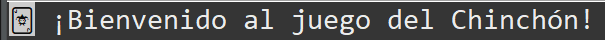
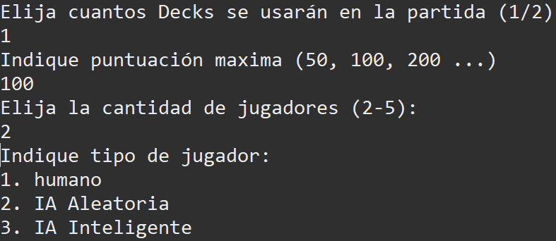
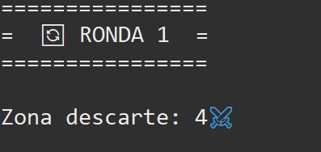
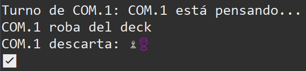
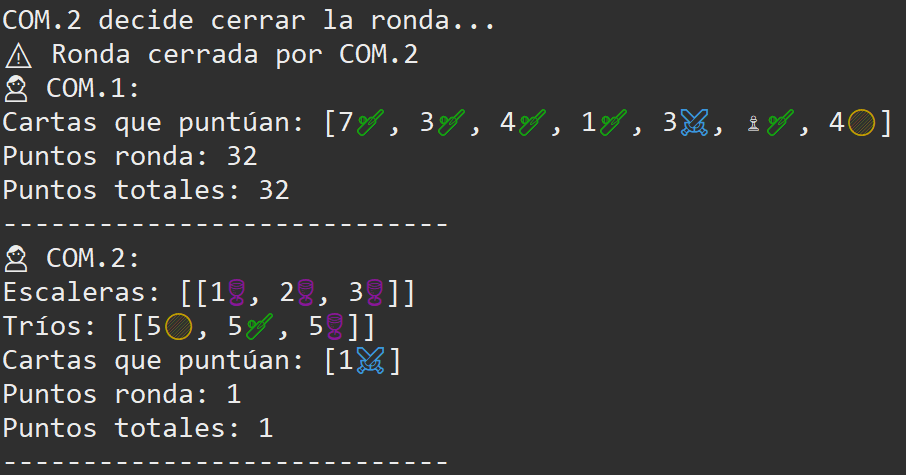
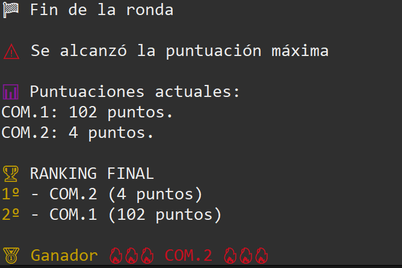
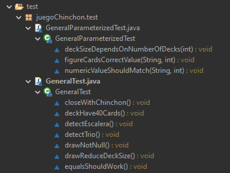
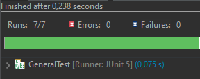
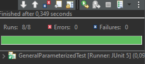

# CHINCHÓN DIGITAL

 Autor: Adrián Díaz Cárdenas

## 1. Introducción

Chinchón Digital es una implementación completa del clásico juego de cartas Chinchón desarrollada
desde cero en Java utilizando Programación Orientada a Objetos, principios SOLID y diferentes patrones
de diseño.

El objetivo principal del proyecto ha sido aplicar los conocimientos adquiridos durante la asignatura de
Entornos de Desarrollo, implementando un software mantenible, escalable y correctamente
documentado.

## 2. Explicación del Juego

### ¿Qué es el Chinchón?

El Chinchón es un juego tradicional de cartas muy popular en España. Los jugadores deben formar
combinaciones de cartas para minimizar los puntos de las cartas no agrupadas.

### Objetivo del juego

Conseguir la menor puntuación posible al finalizar la partida formando:

- Escaleras (cartas consecutivas del mismo palo).
- Tríos (cartas del mismo valor).
- Chinchón (escalera de siete cartas).

### Reglas principales

 Se reparten 7 cartas a cada jugador.

Cada turno un jugador:

- Roba una carta.
- Decide qué carta descartar.

El jugador intenta formar combinaciones válidas.

Cuando considera que tiene una mano suficientemente buena puede cerrar la ronda.

Se calculan los puntos de las cartas no combinadas.

La partida termina cuando un jugador supera la puntuación máxima configurada.

---

### Tipos de jugadores

#### Jugador Humano

Permite introducir decisiones manualmente mediante consola.

#### Random AI

Realiza acciones aleatorias.

#### Smart AI

Evalúa las cartas de la mano y toma decisiones estratégicas para maximizar sus posibilidades de formar
combinaciones.

---

## 3. Transcurso de partida

Mensaje de bienvenida



Configuración de la partida



Inicio de la ronda junto con carta en zona de descarte



Movimientos realizados por los participantes:

- robar

- descartar



- cerrar ronda junto a procesar puntuación de jugadores



Final de ronda mostrará la puntuación actual de cada jugador y al finalizar la partida se mostrará un ranking cuando solo quede un jugador sin maxima puntuación o alguno de los no eliminados saque chinchón.



---

## 4. Estructura del Proyecto

```
ChinchonDigital/
│
├── src/
│ ├── ai/
│ ├── app/
│ ├── factory/
│ ├── game/
│ ├── gameConfig/
│ ├── playerUsers/
│ ├── resources/
│ ├── rules/
│ └── utils/
│
├── test/
│
├── assets/
│
├── doc/
│
└── README.md
```

### Descripción de carpetas

#### src

Contiene todo el código fuente de la aplicación.

#### tests

Contiene las pruebas unitarias desarrolladas con JUnit.

#### doc

Contiene la documentación JavaDoc.

#### assets

Contiene imágenes realizadas para su utilización en el README y documentación.

---

## 5. Diseño UML

Diagrama de Clases


El UML representa la estructura completa del sistema mostrando:

- Herencia.

- Asociaciones.

- Dependencias.

- Interfaces implementadas.

---

## 6. Descripción de Clases

### Game

Responsable de controlar el flujo principal de la partida.

Funciones principales:

- Iniciar partida

- Gestionar rondas

- Calcular puntuaciones

- Determinar ganador

### Player

Clase base para todos los jugadores.

Responsabilidades:

- Gestionar mano de cartas.

- Robar cartas.

- Descartar cartas.

### HumanPlayer

Implementa el comportamiento de un jugador humano.

### RandomAIPlayer

Implementa una IA basada en decisiones aleatorias.

### SmartAIPlayer

Implementa una IA basada en evaluación estratégica de la mano

### Deck

Gestiona el mazo de cartas.

Responsabilidades:

- Crear baraja.

- Barajar.

- Repartir.

- Reconstruir el mazo.

### Card

Representa una carta individual.

### CombinationValidator

Valida:

- Tríos

- Escaleras

- Chinchón

---

## 7. Patrones de Diseño Utilizados

### Factory

Centralizar la creación de jugadores.

Implementación:

`PlayerFactory.createPlayer(...)`

Ventajas

- Evita instanciaciones dispersas.

- Facilita añadir nuevos tipos de jugador.

### Singleton

Garantizar una única instancia de configuración global.

Implementación:

`Config.getInstance();`

Ventajas

- Acceso global controlado.

- Evita duplicidad de configuraciones.

## 8. Pruebas Unitarias

### Estructura



### Comprobación de los tests

- Tests



- Tests Parametrizados


